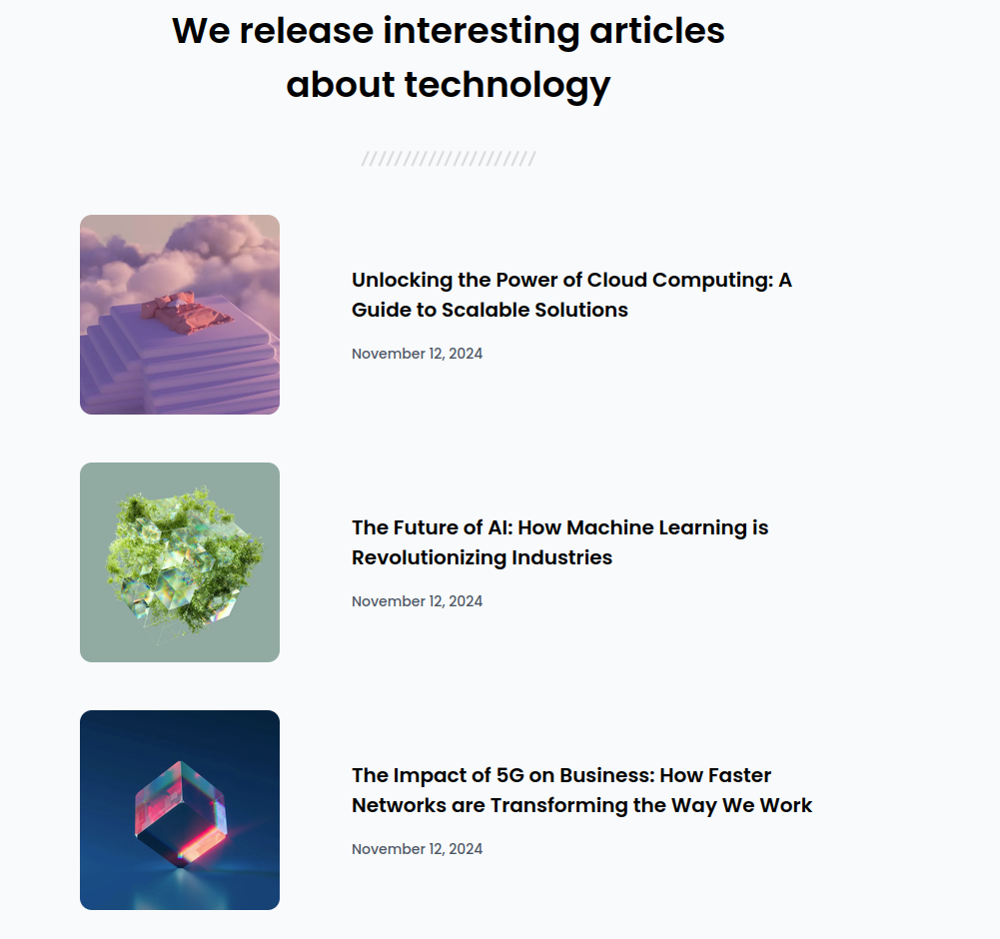

<h1 align="center">Simple Article Listing | devChallenges</h1>

<div align="center">
   Solution for a challenge <a href="https://devchallenges.io/challenge/simple-article-listing" target="_blank">Simple Article Listing</a> from <a href="http://devchallenges.io" target="_blank">devChallenges.io</a>.
</div>

<div align="center">
  <h3>
    <a href="https://shadowbest.github.io/simple-articles-listing/">
      Demo
    </a>
    <span> | </span>
    <a href="https://github.com/Shadowbest/simple-articles-listing">
      Solution
    </a>
    <span> | </span>
    <a href="https://devchallenges.io/challenge/simple-article-listing">
      Challenge
    </a>
  </h3>
</div>

<!-- TABLE OF CONTENTS -->

## Table of Contents

- [Overview](#overview)
  - [What I learned](#what-i-learned)
  - [Useful resources](#useful-resources)
- [Built with](#built-with)
- [Features](#features)
- [Contact](#contact)

<!-- OVERVIEW -->

## Overview



An articles listing page created with CSS Flexbox to make the each article
responsive. Taking care the images don't shrink further if the articles' titles
are too long.

### What I learned

I learned how to use flexbox to make elements responsive. The articles
on smaller screens are stacked but on larger ones they have the image
and title on different columns.

```css
.article {
    display: flex;
    flex-direction: column;
    row-gap: 2rem;
    margin-block-end: 3rem;
}

@media screen and (width > 40em) {
    .article {
        flex-direction: row;
    }
}
```

### Built with

- Semantic HTML5 markup
- CSS custom properties
- Flexbox

## Features

- Responsive layout for articles listing using Flexbox.
- Each article includes a picture, title and publication date.
- Visually appealing layout, clean spacing and typography.

This application/site was created as a submission to a [DevChallenges](https://devchallenges.io/challenges-dashboard) challenge.

## Author

- GitHub [@Shadowbest](https://github.com/Shadowbest)
